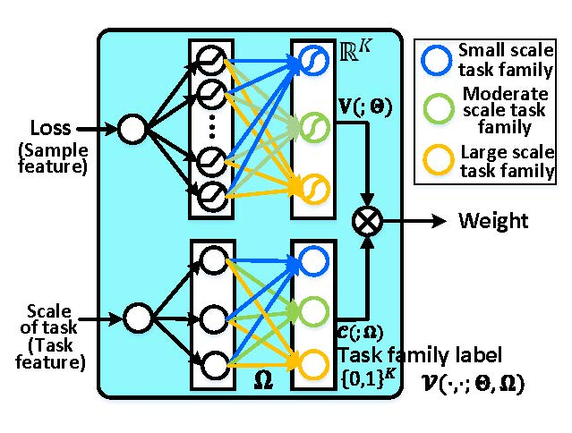
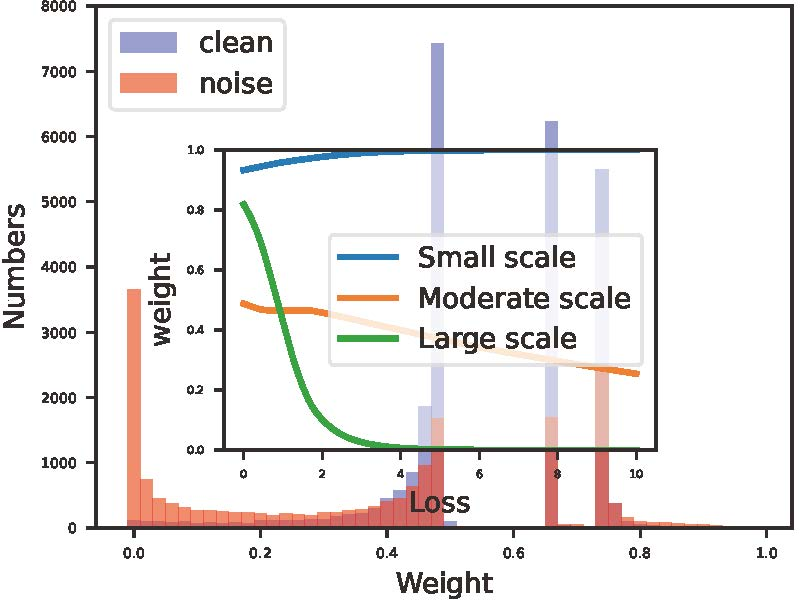
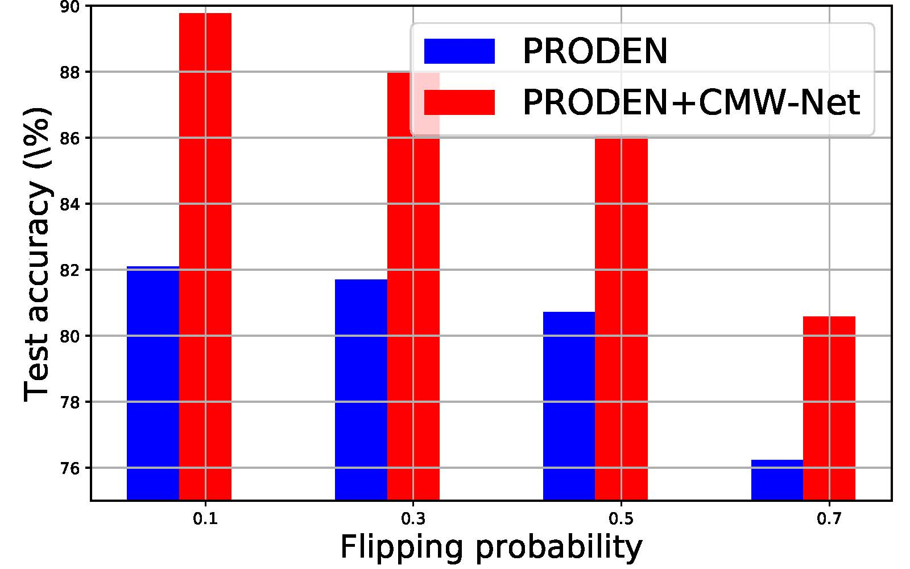
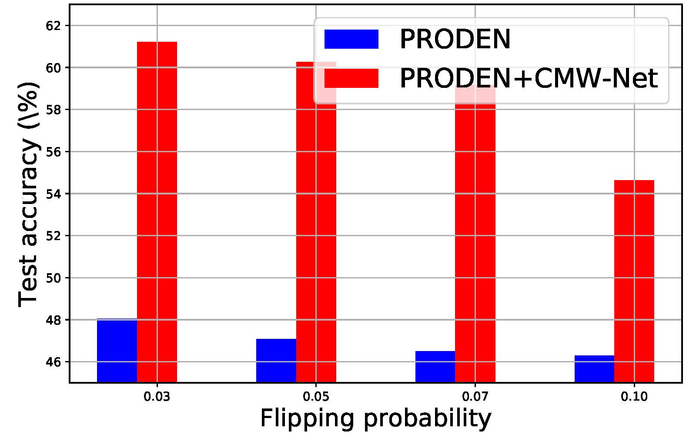

# CMW-Net
This is an official PyTorch implementation of [CMW-Net: Learning a Class-Aware Sample Weighting Mapping for Robust Deep Learning](https://arxiv.org/pdf/2202.05613.pdf).
****
## CONTENTS

* [Overview](#overview)
* [Prerequisites](#prerequisites)
* [Experiments](#experiments)
    * [learning-with-synthetic-biased-data](#learning-with-synthetic-biased-data)
        * [Class Imbalance Experiments](#Class-Imbalance-Experiments)
        * [Feature-independent Label Noise Experiment](#Feature-independent-Label-Noise-Experiment)
        * [Feature-dependent Label Noise Experiment](#Feature-dependent-Label-Noise-Experiment)
    * [learning-with-real-biased-data](#learning-with-real-biased-data)
        * [Learning with Real-world Noisy Datasets](#Learning-with-Real-world-Noisy-Datasets)
        * [Webly Supervised Fine-Grained Recognition](#Webly-Supervised-Fine-Grained-Recognition)
    * [transferability-of-cmw-net](#transferability-of-cmw-net)
    * [extensional-applications](#extensional-applications)
        <!-- * [Partial-Label Learning](#Partial-Label_Learning) -->
* [Citation](#citation)
* [Acknowledgments](#acknowledgments)

## Overview

Modern deep neural networks (DNNs) can easily overfit to biased training data containing corrupted labels or class imbalance.
Sample re-weighting methods are popularly used to alleviate this data bias issue. Most current methods, however, require manually
pre-specifying the weighting schemes as well as their additional hyper-parameters relying on the characteristics of the investigated
problem and training data. This makes them fairly hard to be generally applied in practical scenarios, due to their significant complexities
and inter-class variations of data bias situations. To address this issue, we propose a meta-model capable of adaptively learning an explicit weighting scheme directly from data. Specifically, by seeing each training class as a separate learning task, our method aims to extract an explicit weighting function with sample loss and task/class feature as input, and sample weight as output, expecting to impose adaptively varying weighting schemes to different sample classes based on their own intrinsic bias characteristics. The architectures of the model is blow:
<div  align="center">    
    
</div>

## Prerequisites
* Python 3.7
* PyTorch >= 1.5.0
* Torchvision >= 0.4.0
* sklearn
* torchnet
    
## Experiments
Synthetic and real data experiments substantiate the capability of our method on achieving proper weighting schemes in various data bias cases. The task-transferability of the learned weighting scheme is also substantiated. A performance gain can be readily achieved
compared with previous state-of-the-art ones without additional hyper-parameter tuning and meta gradient descent step. The general availability of our method for multiple robust deep learning issues has also been validated. We provide the running scripts in corresponding code. The detail description and main results are shown below.

### learning with synthetic biased data
<details>
  <summary> <a id='Class-Imbalance-Experiments'>Class Imbalance Experiments</a></summary>

You can repeat the results of Class Imbalance Experiments(TABLE 1 in the paper) by

```
cd section4/Class_Imbalance
bash table1.sh
```

The main results are shown below:
<table class="tg">
<thead>
  <tr>
    <th class="tg-0pky">Dataset Name </th>
    <th class="tg-c3ow" colspan="6">CIFAR-10-LT </th>
    <th class="tg-c3ow" colspan="6">CIFAR-100-LT</th>
  </tr>
</thead>
<tbody>
  <tr>
    <td class="tg-0pky" nowrap>Imbalance factor </td>
    <td class="tg-c3ow">200 </td>
    <td class="tg-c3ow">100 </td>
    <td class="tg-c3ow">50 </td>
    <td class="tg-c3ow">20 </td>
    <td class="tg-c3ow">10 </td>
    <td class="tg-c3ow">1 </td>
    <td class="tg-c3ow">200 </td>
    <td class="tg-c3ow">100 </td>
    <td class="tg-c3ow">50 </td>
    <td class="tg-c3ow">20 </td>
    <td class="tg-c3ow">10 </td>
    <td class="tg-c3ow">1</td>
  </tr>
  <tr>
    <td class="tg-0pky" nowrap>ERM </td>
    <td class="tg-c3ow">34.32 </td>
    <td class="tg-c3ow">29.64 </td>
    <td class="tg-c3ow">25.19 </td>
    <td class="tg-c3ow">17.77 </td>
    <td class="tg-c3ow">13.61 </td>
    <td class="tg-c3ow">7.53 </td>
    <td class="tg-c3ow">65.16 </td>
    <td class="tg-c3ow">61.68 </td>
    <td class="tg-c3ow">56.15 </td>
    <td class="tg-c3ow">48.86 </td>
    <td class="tg-c3ow">44.29 </td>
    <td class="tg-c3ow">29.50</td>
  </tr>
  <tr>
    <td class="tg-0pky" nowrap>Focal loss</td>
    <td class="tg-c3ow">34.71 </td>
    <td class="tg-c3ow">29.62 </td>
    <td class="tg-c3ow">23.29 </td>
    <td class="tg-c3ow">17.24 </td>
    <td class="tg-c3ow">13.34 </td>
    <td class="tg-c3ow">6.97 </td>
    <td class="tg-c3ow">64.38 </td>
    <td class="tg-c3ow">61.59 </td>
    <td class="tg-c3ow">55.68 </td>
    <td class="tg-c3ow">48.05 </td>
    <td class="tg-c3ow">44.22 </td>
    <td class="tg-c3ow">28.85</td>
  </tr>
  <tr>
    <td class="tg-0pky" nowrap>CB loss</td>
    <td class="tg-c3ow">31.11 </td>
    <td class="tg-c3ow">27.63 </td>
    <td class="tg-c3ow">21.95 </td>
    <td class="tg-c3ow">15.64 </td>
    <td class="tg-c3ow">13.23 </td>
    <td class="tg-c3ow">7.53 </td>
    <td class="tg-c3ow">64.44 </td>
    <td class="tg-c3ow">61.23 </td>
    <td class="tg-c3ow">55.21 </td>
    <td class="tg-c3ow">48.06 </td>
    <td class="tg-c3ow">42.43 </td>
    <td class="tg-c3ow">29.37</td>
  </tr>
  <tr>
    <td class="tg-0pky" nowrap>LDAM loss</td>
    <td class="tg-c3ow">- </td>
    <td class="tg-c3ow">26.65 </td>
    <td class="tg-c3ow">- </td>
    <td class="tg-c3ow">- </td>
    <td class="tg-c3ow">13.04 </td>
    <td class="tg-c3ow">- </td>
    <td class="tg-c3ow">60.40 </td>
    <td class="tg-c3ow">- </td>
    <td class="tg-c3ow">- </td>
    <td class="tg-c3ow">- </td>
    <td class="tg-c3ow">43.09 </td>
    <td class="tg-c3ow">-</td>
  </tr>
  <tr>
    <td class="tg-0pky" nowrap>L2RW</td>
    <td class="tg-c3ow">33.49 </td>
    <td class="tg-c3ow">25.84 </td>
    <td class="tg-c3ow">21.07 </td>
    <td class="tg-c3ow">16.90 </td>
    <td class="tg-c3ow">14.81 </td>
    <td class="tg-c3ow">10.75 </td>
    <td class="tg-c3ow">66.62 </td>
    <td class="tg-c3ow">59.77 </td>
    <td class="tg-c3ow">55.56 </td>
    <td class="tg-c3ow">48.36 </td>
    <td class="tg-c3ow">46.27 </td>
    <td class="tg-c3ow">35.89</td>
  </tr>
  <tr>
    <td class="tg-0pky" nowrap>MW-Net </td>
    <td class="tg-c3ow">32.80 </td>
    <td class="tg-c3ow">26.43 </td>
    <td class="tg-c3ow">20.90 </td>
    <td class="tg-c3ow">15.55 </td>
    <td class="tg-c3ow">12.45 </td>
    <td class="tg-c3ow">7.19 </td>
    <td class="tg-c3ow">63.38 </td>
    <td class="tg-c3ow">58.39 </td>
    <td class="tg-c3ow">54.34 </td>
    <td class="tg-c3ow">46.96 </td>
    <td class="tg-c3ow">41.09 </td>
    <td class="tg-c3ow">29.90</td>
  </tr>
  <tr>
    <td class="tg-0pky" nowrap>MCW with CE loss</td>
    <td class="tg-c3ow">29.34 </td>
    <td class="tg-c3ow">23.59 </td>
    <td class="tg-c3ow">19.49 </td>
    <td class="tg-c3ow">13.54 </td>
    <td class="tg-c3ow">11.15 </td>
    <td class="tg-7btt">7.21 </td>
    <td class="tg-7btt">60.69 </td>
    <td class="tg-c3ow">56.65 </td>
    <td class="tg-c3ow">51.47 </td>
    <td class="tg-c3ow">44.38 </td>
    <td class="tg-c3ow">40.42 </td>
    <td class="tg-c3ow">-</td>
  </tr>
  <tr>
    <td class="tg-0pky" nowrap>CMW-Net with CE loss </td>
    <td class="tg-7btt">27.80 </td>
    <td class="tg-7btt">21.15 </td>
    <td class="tg-7btt">17.26 </td>
    <td class="tg-7btt">12.45 </td>
    <td class="tg-7btt">10.97 </td>
    <td class="tg-c3ow">8.30 </td>
    <td class="tg-c3ow">60.85 </td>
    <td class="tg-7btt">55.25 </td>
    <td class="tg-7btt">49.73 </td>
    <td class="tg-7btt">43.06 </td>
    <td class="tg-7btt">39.41 </td>
    <td class="tg-c3ow">30.81</td>
  </tr>
  <tr>
    <td class="tg-0pky" nowrap>MCW with LDAM loss</td>
    <td class="tg-7btt">25.10 </td>
    <td class="tg-c3ow">20.00 </td>
    <td class="tg-c3ow">17.77 </td>
    <td class="tg-c3ow">15.63 </td>
    <td class="tg-c3ow">12.60 </td>
    <td class="tg-c3ow">10.29 </td>
    <td class="tg-c3ow">60.47 </td>
    <td class="tg-c3ow">55.92 </td>
    <td class="tg-7btt">50.84 </td>
    <td class="tg-c3ow">47.62 </td>
    <td class="tg-c3ow">42.00 </td>
    <td class="tg-c3ow">-</td>
  </tr>
  <tr>
    <td class="tg-0pky" nowrap>CMW-Net with LDAM loss </td>
    <td class="tg-c3ow">25.57 </td>
    <td class="tg-7btt">19.95 </td>
    <td class="tg-7btt">17.66 </td>
    <td class="tg-7btt">13.08 </td>
    <td class="tg-7btt">11.42 </td>
    <td class="tg-7btt">7.04 </td>
    <td class="tg-7btt">59.81 </td>
    <td class="tg-7btt">55.87 </td>
    <td class="tg-c3ow">51.14 </td>
    <td class="tg-7btt">45.26 </td>
    <td class="tg-7btt">40.32 </td>
    <td class="tg-7btt">29.19</td>
  </tr>
  <tr>
    <td class="tg-0pky" nowrap>SADE</td>
    <td class="tg-c3ow">19.37 </td>
    <td class="tg-c3ow">16.78 </td>
    <td class="tg-c3ow">14.81 </td>
    <td class="tg-c3ow">11.78 </td>
    <td class="tg-c3ow">9.88 </td>
    <td class="tg-c3ow">7.72 </td>
    <td class="tg-c3ow">54.78 </td>
    <td class="tg-c3ow">50.20 </td>
    <td class="tg-c3ow">46.12 </td>
    <td class="tg-c3ow">40.06 </td>
    <td class="tg-c3ow">36.40 </td>
    <td class="tg-c3ow">28.08</td>
  </tr>
  <tr>
    <td class="tg-0pky" nowrap>CMW-Net with SADE </td>
    <td class="tg-7btt">19.11 </td>
    <td class="tg-7btt">16.04 </td>
    <td class="tg-7btt">13.54 </td>
    <td class="tg-7btt">10.25 </td>
    <td class="tg-7btt">9.39 </td>
    <td class="tg-7btt">5.39 </td>
    <td class="tg-7btt">54.59 </td>
    <td class="tg-7btt">49.50 </td>
    <td class="tg-7btt">46.01 </td>
    <td class="tg-7btt">39.42 </td>
    <td class="tg-7btt">34.78 </td>
    <td class="tg-7btt">27.50</td>
  </tr>
</tbody>
</table>

Details can refer to Section 4.1 of the main paper.

</details>

<details>
  <summary> <a id='Feature-independent-Label-Noise-Experiment'>Feature-independent Label Noise Experiment</a> </summary>


You can repeat the results of Feature-independent Label Noise Experiment(TABLE 2 and TABLE 3 in the paper) by

```
cd section4/Feature-independent_Label_Noise
bash table2.sh
```
The main results are shown below:
<div style="width: 100%; overflow:auto;">
  <table class="tg">
  <thead>
    <tr>
      <th class="tg-0pky" rowspan="2">Datasets</th>
      <th class="tg-c3ow" rowspan="2">Noise</th>
      <th class="tg-c3ow" colspan="4">Symmetric Noise</th>
      <th class="tg-c3ow" colspan="4">Asymmetric Noise</th>
    </tr>
    <tr>
      <th class="tg-0pky">0.2</th>
      <th class="tg-c3ow">0.4</th>
      <th class="tg-c3ow">0.6</th>
      <th class="tg-c3ow">0.8</th>
      <th class="tg-c3ow">0.2</th>
      <th class="tg-c3ow">0.4</th>
      <th class="tg-c3ow">0.6</th>
      <th class="tg-c3ow">0.8</th>
    </tr>
  </thead>
  <tbody>
    <tr>
      <td class="tg-0pky" rowspan="9">CIFAR-10</td>
      <td class="tg-c3ow" nowrap>ERM </td>
      <td class="tg-c3ow" nowrap>86.98 ± 0.12 </td>
      <td class="tg-c3ow" nowrap>77.52 ± 0.41 </td>
      <td class="tg-c3ow" nowrap>73.63 ± 0.85 </td>
      <td class="tg-c3ow" nowrap>53.82 ± 1.04 </td>
      <td class="tg-c3ow" nowrap>83.60 ± 0.24 </td>
      <td class="tg-c3ow" nowrap>77.85 ± 0.98 </td>
      <td class="tg-c3ow" nowrap>69.69 ± 0.72 </td>
      <td class="tg-c3ow" nowrap>55.20 ± 0.28</td>
    </tr>
    <tr>
      <td class="tg-0pky" nowrap>Forward</td>
      <td class="tg-c3ow">87.99 ± 0.36 </td>
      <td class="tg-c3ow">83.25 ± 0.38 </td>
      <td class="tg-c3ow">74.96 ± 0.65 </td>
      <td class="tg-c3ow">54.64 ± 0.44 </td>
      <td class="tg-c3ow">91.34 ± 0.28 </td>
      <td class="tg-c3ow">89.87 ± 0.61 </td>
      <td class="tg-c3ow">87.24 ± 0.96 </td>
      <td class="tg-c3ow">81.07 ± 1.92</td>
    </tr>
    <tr>
      <td class="tg-0pky" nowrap>GCE</td>
      <td class="tg-c3ow">89.99 ± 0.16 </td>
      <td class="tg-c3ow">87.31 ± 0.53 </td>
      <td class="tg-c3ow">82.15 ± 0.47 </td>
      <td class="tg-c3ow">57.36 ± 2.08 </td>
      <td class="tg-c3ow">89.75 ± 1.53 </td>
      <td class="tg-c3ow">87.75 ± 0.36 </td>
      <td class="tg-c3ow">67.21 ± 3.64 </td>
      <td class="tg-c3ow">57.46 ± 0.31</td>
    </tr>
    <tr>
      <td class="tg-0pky" nowrap>M-correction</td>
      <td class="tg-c3ow">93.80 ± 0.23 </td>
      <td class="tg-c3ow">92.53 ± 0.11 </td>
      <td class="tg-c3ow">90.30 ± 0.34 </td>
      <td class="tg-c3ow">86.80 ± 0.11 </td>
      <td class="tg-c3ow">92.15 ± 0.18 </td>
      <td class="tg-c3ow">91.76 ± 0.57 </td>
      <td class="tg-c3ow">87.59 ± 0.33 </td>
      <td class="tg-c3ow">67.78 ± 1.22</td>
    </tr>
    <tr>
      <td class="tg-0pky" nowrap>DivideMix</td>
      <td class="tg-c3ow">95.70 ± 0.31 </td>
      <td class="tg-c3ow">95.00 ± 0.17 </td>
      <td class="tg-c3ow">94.23 ± 0.23 </td>
      <td class="tg-c3ow">92.90 ± 0.31 </td>
      <td class="tg-c3ow">93.96 ± 0.21 </td>
      <td class="tg-c3ow">91.80 ± 0.78 </td>
      <td class="tg-c3ow">80.14 ± 0.45 </td>
      <td class="tg-c3ow">59.23 ± 0.38</td>
    </tr>
    <tr>
      <td class="tg-0pky" nowrap>L2RW</td>
      <td class="tg-c3ow">89.45 ± 0.62 </td>
      <td class="tg-c3ow">87.18 ± 0.84 </td>
      <td class="tg-c3ow">81.57 ± 0.66 </td>
      <td class="tg-c3ow">58.59 ± 1.84 </td>
      <td class="tg-c3ow">90.46 ± 0.56 </td>
      <td class="tg-c3ow">89.76 ± 0.53 </td>
      <td class="tg-c3ow">88.22 ± 0.71 </td>
      <td class="tg-c3ow">85.17 ± 0.31</td>
    </tr>
    <tr>
      <td class="tg-0pky" nowrap>MW-Net</td>
      <td class="tg-c3ow">90.46 ± 0.52 </td>
      <td class="tg-c3ow">86.53 ± 0.57 </td>
      <td class="tg-c3ow">82.98 ± 0.34 </td>
      <td class="tg-c3ow">64.41 ± 0.92 </td>
      <td class="tg-c3ow">92.69 ± 0.24 </td>
      <td class="tg-c3ow">90.17 ± 0.11 </td>
      <td class="tg-c3ow">68.55 ± 0.76 </td>
      <td class="tg-c3ow">58.29 ± 1.33</td>
    </tr>
    <tr>
      <td class="tg-0pky" nowrap>CMW-Net </td>
      <td class="tg-c3ow">91.09 ± 0.54 </td>
      <td class="tg-c3ow">86.91 ± 0.37 </td>
      <td class="tg-c3ow">83.33 ± 0.55 </td>
      <td class="tg-c3ow">64.80 ± 0.72 </td>
      <td class="tg-c3ow">93.02 ± 0.25 </td>
      <td class="tg-c3ow">92.70 ± 0.32 </td>
      <td class="tg-c3ow">91.28 ± 0.40 </td>
      <td class="tg-c3ow">87.50 ± 0.26</td>
    </tr>
    <tr>
      <td class="tg-0pky" nowrap>CMW-Net-SL </td>
      <td class="tg-c3ow">96.20 ± 0.33 </td>
      <td class="tg-c3ow">95.29 ± 0.14 </td>
      <td class="tg-c3ow">94.51 ± 0.32 </td>
      <td class="tg-c3ow">92.10 ± 0.76 </td>
      <td class="tg-c3ow">95.48 ± 0.29 </td>
      <td class="tg-c3ow">94.51 ± 0.52 </td>
      <td class="tg-c3ow">94.18 ± 0.21 </td>
      <td class="tg-c3ow">93.07 ± 0.24</td>
    </tr>
    <tr>
      <td class="tg-0pky" rowspan="9">CIFAR-100</td>
      <td class="tg-c3ow">ERM </td>
      <td class="tg-c3ow">60.38 ± 0.75 </td>
      <td class="tg-c3ow">46.92 ± 0.51 </td>
      <td class="tg-c3ow">31.82 ± 1.16 </td>
      <td class="tg-c3ow">8.29 ± 3.24 </td>
      <td class="tg-c3ow">61.05 ± 0.11 </td>
      <td class="tg-c3ow">50.30 ± 1.11 </td>
      <td class="tg-c3ow">37.34 ± 1.80 </td>
      <td class="tg-c3ow">12.46 ± 0.43</td>
    </tr>
    <tr>
      <td class="tg-0pky" nowrap>Forward</td>
      <td class="tg-c3ow">63.71 ± 0.49 </td>
      <td class="tg-c3ow">49.34 ± 0.60 </td>
      <td class="tg-c3ow">37.90 ± 0.76 </td>
      <td class="tg-c3ow">9.57 ± 1.01 </td>
      <td class="tg-c3ow">64.97 ± 0.47 </td>
      <td class="tg-c3ow">52.37 ± 0.71 </td>
      <td class="tg-c3ow">44.58 ± 0.60 </td>
      <td class="tg-c3ow">15.84 ± 0.62</td>
    </tr>
    <tr>
      <td class="tg-0pky" nowrap>GCE</td>
      <td class="tg-c3ow">68.02 ± 1.05 </td>
      <td class="tg-c3ow">64.18 ± 0.30 </td>
      <td class="tg-c3ow">54.46 ± 0.31 </td>
      <td class="tg-c3ow">15.61 ± 0.97 </td>
      <td class="tg-c3ow">66.15 ± 0.44 </td>
      <td class="tg-c3ow">56.85 ± 0.72 </td>
      <td class="tg-c3ow">40.58 ± 0.47 </td>
      <td class="tg-c3ow">15.82 ± 0.63</td>
    </tr>
    <tr>
      <td class="tg-0pky" nowrap>M-correction</td>
      <td class="tg-c3ow">73.90 ± 0.14 </td>
      <td class="tg-c3ow">70.10 ± 0.14 </td>
      <td class="tg-c3ow">59.50 ± 0.35 </td>
      <td class="tg-c3ow">48.20 ± 0.23 </td>
      <td class="tg-c3ow">71.85 ± 0.19 </td>
      <td class="tg-c3ow">70.83 ± 0.48 </td>
      <td class="tg-c3ow">60.51 ± 0.52 </td>
      <td class="tg-c3ow">16.06 ± 0.33</td>
    </tr>
    <tr>
      <td class="tg-0pky" nowrap>DivideMix</td>
      <td class="tg-c3ow">76.90 ± 0.21 </td>
      <td class="tg-c3ow">75.20 ± 0.12 </td>
      <td class="tg-c3ow">72.00 ± 0.33 </td>
      <td class="tg-c3ow">59.60 ± 0.21 </td>
      <td class="tg-c3ow">76.12 ± 0.44 </td>
      <td class="tg-c3ow">73.47 ± 0.63 </td>
      <td class="tg-c3ow">45.83 ± 0.83 </td>
      <td class="tg-c3ow">16.98 ± 0.40</td>
    </tr>
    <tr>
      <td class="tg-0pky" nowrap>L2RW</td>
      <td class="tg-c3ow">65.32 ± 0.42 </td>
      <td class="tg-c3ow">55.75 ± 0.81 </td>
      <td class="tg-c3ow">41.16 ± 0.85 </td>
      <td class="tg-c3ow">16.80 ± 0.22 </td>
      <td class="tg-c3ow">65.93 ± 0.17 </td>
      <td class="tg-c3ow">62.48 ± 0.56 </td>
      <td class="tg-c3ow">51.66 ± 0.49 </td>
      <td class="tg-c3ow">12.40 ± 0.61</td>
    </tr>
    <tr>
      <td class="tg-0pky" nowrap>MW-Net</td>
      <td class="tg-c3ow">69.93 ± 0.40 </td>
      <td class="tg-c3ow">65.29 ± 0.43 </td>
      <td class="tg-c3ow">55.59 ± 1.07 </td>
      <td class="tg-c3ow">27.63 ± 0.56 </td>
      <td class="tg-c3ow">69.80 ± 0.34 </td>
      <td class="tg-c3ow">64.88 ± 0.63 </td>
      <td class="tg-c3ow">56.89 ± 0.95 </td>
      <td class="tg-c3ow">17.05 ± 0.52</td>
    </tr>
    <tr>
      <td class="tg-0pky" nowrap>CMW-Net </td>
      <td class="tg-c3ow">70.11 ± 0.19 </td>
      <td class="tg-c3ow">65.84 ± 0.50 </td>
      <td class="tg-c3ow">56.93 ± 0.38 </td>
      <td class="tg-c3ow">28.36 ± 0.67 </td>
      <td class="tg-c3ow">71.07 ± 0.56 </td>
      <td class="tg-c3ow">66.15 ± 0.51 </td>
      <td class="tg-c3ow">58.21 ± 0.78 </td>
      <td class="tg-c3ow">17.41 ± 0.16</td>
    </tr>
    <tr>
      <td class="tg-0pky" nowrap>CMW-Net-SL </td>
      <td class="tg-c3ow">77.84 ± 0.12 </td>
      <td class="tg-c3ow">76.25 ± 0.67 </td>
      <td class="tg-c3ow">72.61 ± 0.92 </td>
      <td class="tg-c3ow">55.21 ± 0.31 </td>
      <td class="tg-c3ow">77.73 ± 0.37 </td>
      <td class="tg-c3ow">75.69 ± 0.68 </td>
      <td class="tg-c3ow">61.54 ± 0.72 </td>
      <td class="tg-c3ow">18.34 ± 0.21</td>
    </tr>
  </tbody>
  </table>
</div>

<table class="tg">
<thead>
  <tr>
    <th class="tg-c3ow" rowspan="2">Datasets</th>
    <th class="tg-c3ow" rowspan="2">Noise</th>
    <th class="tg-c3ow" colspan="4">Symmetric</th>
    <th class="tg-c3ow">Asy. Noise</th>
  </tr>
  <tr>
    <th class="tg-c3ow">0.2 </th>
    <th class="tg-c3ow">0.5 </th>
    <th class="tg-c3ow">0.8 </th>
    <th class="tg-c3ow">0.9 </th>
    <th class="tg-c3ow">0.4</th>
  </tr>
</thead>
<tbody>
  <tr>
    <td class="tg-c3ow" rowspan="8">CIFAR-10</td>
    <td class="tg-c3ow">DivideMix</td>
    <td class="tg-c3ow">95.7 </td>
    <td class="tg-c3ow">94.4 </td>
    <td class="tg-c3ow">92.9 </td>
    <td class="tg-c3ow">75.4 </td>
    <td class="tg-c3ow">92.1</td>
  </tr>
  <tr>
    <td class="tg-c3ow">ELR+</td>
    <td class="tg-c3ow">94.6 </td>
    <td class="tg-c3ow">93.8 </td>
    <td class="tg-c3ow">93.1 </td>
    <td class="tg-c3ow">75.2 </td>
    <td class="tg-c3ow">92.7</td>
  </tr>
  <tr>
    <td class="tg-c3ow">REED</td>
    <td class="tg-c3ow">95.7 </td>
    <td class="tg-c3ow">95.4 </td>
    <td class="tg-c3ow">94.1 </td>
    <td class="tg-c3ow">93.5 </td>
    <td class="tg-c3ow">-</td>
  </tr>
  <tr>
    <td class="tg-c3ow">AugDesc</td>
    <td class="tg-c3ow">96.2 </td>
    <td class="tg-c3ow">95.1 </td>
    <td class="tg-c3ow">93.6 </td>
    <td class="tg-c3ow">91.8 </td>
    <td class="tg-c3ow">94.3</td>
  </tr>
  <tr>
    <td class="tg-c3ow">C2D</td>
    <td class="tg-c3ow">96.2 </td>
    <td class="tg-c3ow">95.1 </td>
    <td class="tg-c3ow">94.3 </td>
    <td class="tg-c3ow">93.4 </td>
    <td class="tg-c3ow">90.8</td>
  </tr>
  <tr>
    <td class="tg-c3ow">Two-step</td>
    <td class="tg-c3ow">96.2 </td>
    <td class="tg-c3ow">95.3 </td>
    <td class="tg-c3ow">93.7 </td>
    <td class="tg-c3ow">92.7 </td>
    <td class="tg-c3ow">92.4</td>
  </tr>
  <tr>
    <td class="tg-c3ow">CMW-Net-SL </td>
    <td class="tg-c3ow">96.2 </td>
    <td class="tg-c3ow">95.1 </td>
    <td class="tg-c3ow">92.1 </td>
    <td class="tg-c3ow">48.0 </td>
    <td class="tg-c3ow">94.5</td>
  </tr>
  <tr>
    <td class="tg-c3ow">CMW-Net-SL+ </td>
    <td class="tg-c3ow">96.6 </td>
    <td class="tg-c3ow">96.2 </td>
    <td class="tg-c3ow">95.4 </td>
    <td class="tg-c3ow">93.7 </td>
    <td class="tg-c3ow">96.0</td>
  </tr>
  <tr>
    <td class="tg-c3ow" rowspan="8">CIFAR-100</td>
    <td class="tg-c3ow">DivideMix</td>
    <td class="tg-c3ow">77.3 </td>
    <td class="tg-c3ow">74.6 </td>
    <td class="tg-c3ow">60.2 </td>
    <td class="tg-c3ow">31.5 </td>
    <td class="tg-c3ow">72.1</td>
  </tr>
  <tr>
    <td class="tg-c3ow">ELR+</td>
    <td class="tg-c3ow">77.5 </td>
    <td class="tg-c3ow">72.4 </td>
    <td class="tg-c3ow">58.2 </td>
    <td class="tg-c3ow">30.8 </td>
    <td class="tg-c3ow">76.5</td>
  </tr>
  <tr>
    <td class="tg-c3ow">REED</td>
    <td class="tg-c3ow">76.5 </td>
    <td class="tg-c3ow">72.2 </td>
    <td class="tg-c3ow">66.5 </td>
    <td class="tg-c3ow">59.4 </td>
    <td class="tg-c3ow">-</td>
  </tr>
  <tr>
    <td class="tg-c3ow">AugDesc</td>
    <td class="tg-c3ow">79.2 </td>
    <td class="tg-c3ow">77.0 </td>
    <td class="tg-c3ow">66.1 </td>
    <td class="tg-c3ow">40.9 </td>
    <td class="tg-c3ow">76.8</td>
  </tr>
  <tr>
    <td class="tg-c3ow">C2D</td>
    <td class="tg-c3ow">78.3 </td>
    <td class="tg-c3ow">76.1 </td>
    <td class="tg-c3ow">67.4 </td>
    <td class="tg-c3ow">58.5 </td>
    <td class="tg-c3ow">75.1</td>
  </tr>
  <tr>
    <td class="tg-c3ow">Two-step</td>
    <td class="tg-c3ow">79.1 </td>
    <td class="tg-c3ow">78.2 </td>
    <td class="tg-c3ow">70.1 </td>
    <td class="tg-c3ow">53.2 </td>
    <td class="tg-c3ow">65.5</td>
  </tr>
  <tr>
    <td class="tg-c3ow">CMW-Net-SL </td>
    <td class="tg-c3ow">77.84 </td>
    <td class="tg-c3ow">76.2 </td>
    <td class="tg-c3ow">55.2 </td>
    <td class="tg-c3ow">21.2 </td>
    <td class="tg-c3ow">75.7</td>
  </tr>
  <tr>
    <td class="tg-c3ow">CMW-Net-SL+ </td>
    <td class="tg-c3ow">80.2 </td>
    <td class="tg-c3ow">78.2 </td>
    <td class="tg-c3ow">71.1 </td>
    <td class="tg-c3ow">64.6 </td>
    <td class="tg-c3ow">77.2</td>
  </tr>
</tbody>
</table>

Details can refer to Section 4.2 of the main paper.

</details>

<details>
  <summary> <a id='Feature-dependent-Label-Noise-Experiment'>Feature-dependent Label Noise Experiment</a> </summary>

You can repeat the results of TABLE 4 in the paper by
```
cd section4/Feature-dependent_Label_Noise
bash table4.sh
```
The main results are shown below:
<table class="tg">
<thead>
  <tr>
    <th class="tg-cly1" nowrap>Datasets </th>
    <th class="tg-cly1" nowrap>Noise </th>
    <th class="tg-cly1" nowrap>ERM </th>
    <th class="tg-cly1" nowrap>LRT</th>
    <th class="tg-cly1" nowrap>GCE</th>
    <th class="tg-cly1" nowrap>MW-Net</th>
    <th class="tg-cly1" nowrap>PLC</th>
    <th class="tg-cly1" nowrap>CMW-Net </th>
    <th class="tg-cly1" nowrap>CMW-Net-SL</th>
  </tr>
</thead>
<tbody>
  <tr>
    <td class="tg-cly1" rowspan="6">CIFAR-10</td>
    <td class="tg-cly1" nowrap>Type-I (35%) </td>
    <td class="tg-cly1" nowrap>78.11 ± 0.74 </td>
    <td class="tg-cly1" nowrap>80.98 ± 0.80 </td>
    <td class="tg-cly1" nowrap>80.65 ± 0.39 </td>
    <td class="tg-cly1" nowrap>82.20 ± 0.40 </td>
    <td class="tg-cly1" nowrap>82.80 ± 0.27 </td>
    <td class="tg-cly1" nowrap>82.27 ± 0.33 </td>
    <td class="tg-cly1" nowrap>84.23 ± 0.17</td>
  </tr>
  <tr>
    <td class="tg-cly1" nowrap>Type-I (70%) </td>
    <td class="tg-cly1" nowrap>41.98 ± 1.96 </td>
    <td class="tg-cly1" nowrap>41.52 ± 4.53 </td>
    <td class="tg-cly1" nowrap>36.52 ± 1.62 </td>
    <td class="tg-cly1" nowrap>38.85 ± 0.67 </td>
    <td class="tg-cly1" nowrap>42.74 ± 2.14 </td>
    <td class="tg-cly1" nowrap>42.23 ± 0.69 </td>
    <td class="tg-cly1" nowrap>44.19 ± 0.69</td>
  </tr>
  <tr>
    <td class="tg-cly1" nowrap>Type-II (35%) </td>
    <td class="tg-cly1" nowrap>76.65 ± 0.57 </td>
    <td class="tg-cly1" nowrap>80.74 ± 0.25 </td>
    <td class="tg-cly1" nowrap>77.60 ± 0.88 </td>
    <td class="tg-cly1" nowrap>81.28 ± 0.56 </td>
    <td class="tg-cly1" nowrap>81.54 ± 0.47 </td>
    <td class="tg-cly1" nowrap>81.69 ± 0.57 </td>
    <td class="tg-cly1" nowrap>83.12 ± 0.40</td>
  </tr>
  <tr>
    <td class="tg-cly1" nowrap>Type-II (70%) </td>
    <td class="tg-cly1" nowrap>45.57 ± 1.12 </td>
    <td class="tg-cly1" nowrap>81.08 ± 0.35 </td>
    <td class="tg-cly1" nowrap>40.30 ± 1.46 </td>
    <td class="tg-cly1" nowrap>42.15 ± 1.07 </td>
    <td class="tg-cly1" nowrap>46.04 ± 2.20 </td>
    <td class="tg-cly1" nowrap>46.30 ± 0.77 </td>
    <td class="tg-cly1" nowrap>48.26 ± 0.88</td>
  </tr>
  <tr>
    <td class="tg-cly1" nowrap>Type-III (35%) </td>
    <td class="tg-cly1" nowrap>76.89 ± 0.79 </td>
    <td class="tg-cly1" nowrap>76.89 ± 0.79 </td>
    <td class="tg-cly1" nowrap>79.18 ± 0.61 </td>
    <td class="tg-cly1" nowrap>81.57 ± 0.73 </td>
    <td class="tg-cly1" nowrap>81.50 ± 0.50 </td>
    <td class="tg-cly1" nowrap>81.52 ± 0.38 </td>
    <td class="tg-cly1" nowrap>83.10 ± 0.34</td>
  </tr>
  <tr>
    <td class="tg-cly1" nowrap>Type-III (70%) </td>
    <td class="tg-cly1" nowrap>43.32 ± 1.00 </td>
    <td class="tg-cly1" nowrap>44.47 ± 1.23 </td>
    <td class="tg-cly1" nowrap>37.10 ± 0.59 </td>
    <td class="tg-cly1" nowrap>42.43 ± 1.27 </td>
    <td class="tg-cly1" nowrap>45.05 ± 1.13 </td>
    <td class="tg-cly1" nowrap>43.76 ± 0.96 </td>
    <td class="tg-cly1" nowrap>45.15 ± 0.91</td>
  </tr>
  <tr>
    <td class="tg-cly1" rowspan="6">CIFAR-100</td>
    <td class="tg-cly1" nowrap>Type-I (35%) </td>
    <td class="tg-cly1" nowrap>57.68 ± 0.29 </td>
    <td class="tg-cly1" nowrap>56.74 ± 0.34 </td>
    <td class="tg-cly1" nowrap>58.37 ± 0.18 </td>
    <td class="tg-cly1" nowrap>62.10 ± 0.50 </td>
    <td class="tg-cly1" nowrap>60.01 ± 0.43 </td>
    <td class="tg-cly1" nowrap>62.43 ± 0.38 </td>
    <td class="tg-cly1" nowrap>64.01 ± 0.11</td>
  </tr>
  <tr>
    <td class="tg-cly1" nowrap>Type-I (70%) </td>
    <td class="tg-cly1" nowrap>39.32 ± 0.43 </td>
    <td class="tg-cly1" nowrap>45.29 ± 0.43 </td>
    <td class="tg-cly1" nowrap>40.01 ± 0.71 </td>
    <td class="tg-cly1" nowrap>44.71 ± 0.49 </td>
    <td class="tg-cly1" nowrap>45.92 ± 0.61 </td>
    <td class="tg-cly1" nowrap>46.68 ± 0.64 </td>
    <td class="tg-cly1" nowrap>47.62 ± 0.44</td>
  </tr>
  <tr>
    <td class="tg-cly1" nowrap>Type-II (35%) </td>
    <td class="tg-cly1" nowrap>57.83 ± 0.25 </td>
    <td class="tg-cly1" nowrap>57.25 ± 0.68 </td>
    <td class="tg-cly1" nowrap>58.11 ± 1.05 </td>
    <td class="tg-cly1" nowrap>63.78 ± 0.24 </td>
    <td class="tg-cly1" nowrap>63.68 ± 0.29 </td>
    <td class="tg-cly1" nowrap>64.08 ± 0.26 </td>
    <td class="tg-cly1" nowrap>64.13 ± 0.19</td>
  </tr>
  <tr>
    <td class="tg-cly1" nowrap>Type-II (70%) </td>
    <td class="tg-cly1" nowrap>39.30 ± 0.32 </td>
    <td class="tg-cly1" nowrap>43.71 ± 0.51 </td>
    <td class="tg-cly1" nowrap>37.75 ± 0.46 </td>
    <td class="tg-cly1" nowrap>44.61 ± 0.41 </td>
    <td class="tg-cly1" nowrap>45.03 ± 0.50 </td>
    <td class="tg-cly1" nowrap>50.01 ± 0.51 </td>
    <td class="tg-cly1" nowrap>51.99 ± 0.35</td>
  </tr>
  <tr>
    <td class="tg-cly1" nowrap>Type-III (35%) </td>
    <td class="tg-cly1" nowrap>56.07 ± 0.79 </td>
    <td class="tg-cly1" nowrap>56.57 ± 0.30 </td>
    <td class="tg-cly1" nowrap>57.51 ± 1.16 </td>
    <td class="tg-cly1" nowrap>62.53 ± 0.33 </td>
    <td class="tg-cly1" nowrap>63.68 ± 0.29 </td>
    <td class="tg-cly1" nowrap>63.21 ± 0.23 </td>
    <td class="tg-cly1" nowrap>64.47 ± 0.15</td>
  </tr>
  <tr>
    <td class="tg-cly1" nowrap>Type-III (70%) </td>
    <td class="tg-cly1" nowrap>40.01 ± 0.18 </td>
    <td class="tg-cly1" nowrap>44.41 ± 0.19 </td>
    <td class="tg-cly1" nowrap>40.53 ± 0.60 </td>
    <td class="tg-cly1" nowrap>45.17 ± 0.77 </td>
    <td class="tg-cly1" nowrap>44.45 ± 0.62 </td>
    <td class="tg-cly1" nowrap>47.38 ± 0.65 </td>
    <td class="tg-cly1" nowrap>48.78 ± 0.62</td>
  </tr>
</tbody>
</table>

We can repeat the results of TABLE 5 in the paper by
```
cd section4/Feature-dependent_Label_Noise
bash table5.sh
```
The main results are shown below:
<table class="tg">
<thead>
  <tr>
    <th class="tg-nrix" nowrap>Datasets </th>
    <th class="tg-nrix" nowrap>Noise </th>
    <th class="tg-nrix" nowrap>ERM </th>
    <th class="tg-nrix" nowrap>LRT</th>
    <th class="tg-nrix" nowrap>GCE</th>
    <th class="tg-nrix" nowrap>MW-Net</th>
    <th class="tg-nrix" nowrap>PLC</th>
    <th class="tg-nrix" nowrap>CMW-Net </th>
    <th class="tg-nrix" nowrap>CMW-Net-SL</th>
  </tr>
</thead>
<tbody>
  <tr>
    <td class="tg-nrix" rowspan="6">CIFAR-10</td>
    <td class="tg-nrix" nowrap>Type-I + Symmetric </td>
    <td class="tg-nrix" nowrap>75.26 ± 0.32 </td>
    <td class="tg-nrix" nowrap>75.97 ± 0.27 </td>
    <td class="tg-nrix" nowrap>78.08 ± 0.66 </td>
    <td class="tg-nrix" nowrap>76.39 ± 0.42 </td>
    <td class="tg-nrix" nowrap>79.04 ± 0.50 </td>
    <td class="tg-nrix" nowrap>78.42 ± 0.47 </td>
    <td class="tg-nrix" nowrap>82.00 ± 0.36</td>
  </tr>
  <tr>
    <td class="tg-nrix" nowrap>Type-I + Asymmetric </td>
    <td class="tg-nrix" nowrap>75.21 ± 0.64 </td>
    <td class="tg-nrix" nowrap>76.96 ± 0.45 </td>
    <td class="tg-nrix" nowrap>76.91 ± 0.56 </td>
    <td class="tg-nrix" nowrap>76.54 ± 0.56 </td>
    <td class="tg-nrix" nowrap>78.31 ± 0.41 </td>
    <td class="tg-nrix" nowrap>77.14 ± 0.38 </td>
    <td class="tg-nrix" nowrap>80.69 ± 0.47</td>
  </tr>
  <tr>
    <td class="tg-nrix" nowrap>Type-II + Symmetric </td>
    <td class="tg-nrix" nowrap>74.92 ± 0.63 </td>
    <td class="tg-nrix" nowrap>75.94 ± 0.58 </td>
    <td class="tg-nrix" nowrap>75.69 ± 0.21 </td>
    <td class="tg-nrix" nowrap>76.57 ± 0.81 </td>
    <td class="tg-nrix" nowrap>80.08 ± 0.37 </td>
    <td class="tg-nrix" nowrap>76.77 ± 0.63 </td>
    <td class="tg-nrix" nowrap>80.96 ± 0.23</td>
  </tr>
  <tr>
    <td class="tg-nrix" nowrap>Type-II + Asymmetric </td>
    <td class="tg-nrix" nowrap>74.28 ± 0.39 </td>
    <td class="tg-nrix" nowrap>77.03 ± 0.62 </td>
    <td class="tg-nrix" nowrap>75.30 ± 0.81 </td>
    <td class="tg-nrix" nowrap>75.35 ± 0.40 </td>
    <td class="tg-nrix" nowrap>77.63 ± 0.30 </td>
    <td class="tg-nrix" nowrap>77.08 ± 0.52 </td>
    <td class="tg-nrix" nowrap>80.94 ± 0.14</td>
  </tr>
  <tr>
    <td class="tg-nrix" nowrap>Type-III + Symmetric </td>
    <td class="tg-nrix" nowrap>74.00 ± 0.38 </td>
    <td class="tg-nrix" nowrap>75.66 ± 0.57 </td>
    <td class="tg-nrix" nowrap>77.00 ± 0.12 </td>
    <td class="tg-nrix" nowrap>76.28 ± 0.82 </td>
    <td class="tg-nrix" nowrap>80.06 ± 0.47 </td>
    <td class="tg-nrix" nowrap>77.16 ± 0.30 </td>
    <td class="tg-nrix" nowrap>81.58 ± 0.55</td>
  </tr>
  <tr>
    <td class="tg-nrix" nowrap>Type-III + Asymmetric </td>
    <td class="tg-nrix" nowrap>75.31 ± 0.34 </td>
    <td class="tg-nrix" nowrap>77.19 ± 0.74 </td>
    <td class="tg-nrix" nowrap>75.70 ± 0.91 </td>
    <td class="tg-nrix" nowrap>75.82 ± 0.77 </td>
    <td class="tg-nrix" nowrap>77.54 ± 0.70 </td>
    <td class="tg-nrix" nowrap>76.49 ± 0.88 </td>
    <td class="tg-nrix" nowrap>80.48 ± 0.48</td>
  </tr>
  <tr>
    <td class="tg-nrix" rowspan="6">CIFAR-100</td>
    <td class="tg-nrix" nowrap>Type-I + Symmetric </td>
    <td class="tg-nrix" nowrap>48.86 ± 0.56 </td>
    <td class="tg-nrix" nowrap>45.66 ± 1.60 </td>
    <td class="tg-nrix" nowrap>52.90 ± 0.53 </td>
    <td class="tg-nrix" nowrap>57.70 ± 0.32 </td>
    <td class="tg-nrix" nowrap>60.09 ± 0.15 </td>
    <td class="tg-nrix" nowrap>59.17 ± 0.42 </td>
    <td class="tg-nrix" nowrap>60.87 ± 0.56</td>
  </tr>
  <tr>
    <td class="tg-nrix" nowrap>Type-I + Asymmetric </td>
    <td class="tg-nrix" nowrap>45.85 ± 0.93 </td>
    <td class="tg-nrix" nowrap>52.04 ± 0.15 </td>
    <td class="tg-nrix" nowrap>52.69 ± 1.14 </td>
    <td class="tg-nrix" nowrap>56.61 ± 0.71 </td>
    <td class="tg-nrix" nowrap>56.40 ± 0.34 </td>
    <td class="tg-nrix" nowrap>57.42 ± 0.81 </td>
    <td class="tg-nrix" nowrap>61.35 ± 0.52</td>
  </tr>
  <tr>
    <td class="tg-nrix" nowrap>Type-II + Symmetric </td>
    <td class="tg-nrix" nowrap>49.32 ± 0.36 </td>
    <td class="tg-nrix" nowrap>43.86 ± 1.31 </td>
    <td class="tg-nrix" nowrap>53.61 ± 0.46 </td>
    <td class="tg-nrix" nowrap>54.08 ± 0.18 </td>
    <td class="tg-nrix" nowrap>60.01 ± 0.63 </td>
    <td class="tg-nrix" nowrap>59.16 ± 0.18 </td>
    <td class="tg-nrix" nowrap>61.00 ± 0.41</td>
  </tr>
  <tr>
    <td class="tg-nrix" nowrap>Type-II + Asymmetric </td>
    <td class="tg-nrix" nowrap>46.50 ± 0.95 </td>
    <td class="tg-nrix" nowrap>52.11 ± 0.46 </td>
    <td class="tg-nrix" nowrap>51.98 ± 0.37 </td>
    <td class="tg-nrix" nowrap>58.53 ± 0.45 </td>
    <td class="tg-nrix" nowrap>61.43 ± 0.33 </td>
    <td class="tg-nrix" nowrap>58.99 ± 0.91 </td>
    <td class="tg-nrix" nowrap>61.35 ± 0.57</td>
  </tr>
  <tr>
    <td class="tg-nrix" nowrap>Type-III + Symmetric </td>
    <td class="tg-nrix" nowrap>48.94 ± 0.61 </td>
    <td class="tg-nrix" nowrap>42.79 ± 1.78 </td>
    <td class="tg-nrix" nowrap>52.07 ± 0.35 </td>
    <td class="tg-nrix" nowrap>55.29 ± 0.57 </td>
    <td class="tg-nrix" nowrap>60.14 ± 0.97 </td>
    <td class="tg-nrix" nowrap>58.48 ± 0.79 </td>
    <td class="tg-nrix" nowrap>60.21 ± 0.48</td>
  </tr>
  <tr>
    <td class="tg-nrix" nowrap>Type-III + Asymmetric </td>
    <td class="tg-nrix" nowrap>45.70 ± 0.12 </td>
    <td class="tg-nrix" nowrap>50.31 ± 0.39 </td>
    <td class="tg-nrix" nowrap>50.87 ± 1.12 </td>
    <td class="tg-nrix" nowrap>58.43 ± 0.60 </td>
    <td class="tg-nrix" nowrap>54.56 ± 1.11 </td>
    <td class="tg-nrix" nowrap>58.83 ± 0.57 </td>
    <td class="tg-nrix" nowrap>60.52 ± 0.53</td>
  </tr>
</tbody>
</table>

Details can refer to Section 4.3 of the main paper.

</details>


### learning with real biased data
<details>
  <summary> <a id='Learning-with-Real-world-Noisy-Datasets'>Learning with Real-world Noisy Datasets</a> </summary>

We test our method in the ANIMAL-10N and mini WebVision.
You can repeat the results in the ANIMAL-10N (TABLE 6 in the paper) by
```
cd section5/ANIMAL-10N
bash table6.sh
```
The main results are shown below:
| Method |  Test Accuracy | Method |  Test Accuracy |
|:----:|:----:|:----:|:----:|
|ERM  | 79.4 $\pm$ 0.14 | ActiveBias |  80.5 $\pm$ 0.26 |
| Co-teaching | 80.2 $\pm$ 0.13 |SELFIE | 81.8 $\pm$ 0.09 |
| PLC |   83.4 $\pm$ 0.43 | MW-Net |  80.7 $\pm$ 0.52 |
| CMW-Net |  80.9 $\pm$ 0.48  |  CMW-Net-SL  | 84.7 $\pm$ 0.28 |

You can repeat the results in the mini WebVision (TABLE 7 in the paper) by
```
cd section5/mini_WebVision
bash table7.sh
```
The main results are shown below:
| Methods| ILSVRC12 top1 | ILSVRC12 top5 | WebVision top1 | WebVision top5 |
|:----:|:----:|:----:|:----:|:----:|
|Forward | 61.12 |82.68 |  57.36 | 82.36  |
|MentorNet |  63.00| 81.40 |57.80| 79.92  |
| Co-teaching | 63.58 |85.20|61.48 |84.70 |
| Interative-CV |   65.24 |85.34| 61.60| 84.98 |
| MW-Net | 69.34 | 87.44 | 65.80 | 87.52  |
| CMW-Net  | 70.56 | 88.76 | 66.44 | 87.68 |
|DivideMix | 77.32 | 91.64| 75.20 | 90.84  |
| ELR | 77.78 | 91.68| 70.29 | 89.76  |
| DivideMix |   76.32 | 90.65| 74.42 | 91.21  |	
| CMW-Net-SL |   78.08 | 92.96| 75.72 | 92.52  |
| DivideMix with C2D | 79.42 | 92.32 |  78.57 | 93.04  |
| CMW-Net-SL+C2D | 80.44 | 93.36 | 77.36 | 93.48 |

Details can refer to Section 5.1 of the main paper.

</details>

<details>
  <summary> <a id='Webly-Supervised-Fine-Grained-Recognition'>Webly Supervised Fine-Grained Recognition</a> </summary>

We further run our method on a benchmark WebFG-496
dataset consisting of three sub-datasets:
Web-aircraft, Web-bird, Web-car,
You can repeat the results in the mini WebVision (TABLE 7 in the paper) by
```
cd section5/WebFG-496
bash table8.sh
```
The main results are shown below:
|Methods | Web-Bird | Web-Aircraft | Web-Car |Average   | 
|:----:|:----:|:----:|:----:|:----:|
|ERM | 66.56 | 64.33 | 67.42 |66.10  |
|Decoupling | 70.56 |75.97 |75.00| 73.84  |
|Co-teaching | 73.85| 72.76 |73.10 |73.24    |
|Peer-learning | 76.48 |74.38| 78.52 |76.46  |
|MW-Net      | 75.60 | 72.93 | 77.33 |  75.29 |
|CMW-Net     | 75.72 | 73.72 | 77.42 | 75.62  |
|CMW-Net-SL | 77.41 | 76.48 | 79.70 | 77.86 |

Details can refer to Section 5.2 of the main paper.

</details>


### transferability of CMW-Net
A potential usefulness of the metalearned weighing scheme by CMW-Net is that it is modelagnostic and hopefully equipped into other learning algorithms in a plug-and-play manner. To validate such transferable capability of CMW-Net, we attempt to transfer meta-learned CMW-Net on relatively smaller dataset to significantly larger-scale ones. In specific, we use CMWNet trained on CIFAR-10 with feature-dependent label noise (i.e.,35% Type-I + 30% Asymmetric) as introduced in Sec. 4.3 in the paper since it finely simulates the real-world noise configuration. The extracted weighting function is depicted blew.

<div  align="center">    
    
</div>


<details>
  <summary> <a id='Webvisoin-dataset'>Webvisoin dataset</a> </summary>

We deploy it on full WebVision. Even with a relatively concise form, our method still outperforms the
second-best Heteroscedastic method by an evident margin. This further validates the potential usefulness of CMWNet to practical large-scale problems with complicated data bias situations, with an intrinsic reduction of the labor and computation costs by readily specifying proper weighting scheme for a learning algorithm. You can repeat the performance on full WebVision(TABLE 10 in the main paper) by
```
cd section6/webvision
bash table10.sh
```
The main results are shown below:
| Methods| ILSVRC12 top1 | ILSVRC12 top5 | WebVision top1 | WebVision top5 |
|:----:|:----:|:----:|:----:|:----:|
ERM | 69.7 |87.0 | 62.9 | 83.6  |
MentorNet | 70.8| 88.0 |62.5| 83.0  |
MentorMix | {74.3} |90.5|67.5 |{87.2}  |
HAR | 75.0 | 90.6 | 67.1 | 86.7 |
MILE | 76.5 | 90.9 | 68.7 |  86.4  |
Heteroscedastic | 76.6  |  92.1 | 68.6 |  87.1  |	
CurriculumNet | 79.3 | 93.6 | - | - |
ERM + CMW-Net-SL   | 77.9 | 92.6 | 69.6 | 88.5 |

</details>

Details can refer to Section 6 of the main paper.


### extensional applications
We evaluate the generality of our proposed adaptive
sample weighting strategy in more robust learning tasks.

<details>
  <summary> <a id='Partial-Label_Learning'>Partial-Label Learning</a> </summary>

It is seen that CMW-Net can significantly enhance the performance of the baseline method in both test cases, showing its potential usability in this Partial-Label Learning task. You can repeat the performance in Partial-Label Learning(Fig 9 in the paper) by
```
cd section7/Partial-Label_Learning
bash fig9.sh
```
The main results are shown below.

Accuracy comparisons on PRODEN w/o CMW-Net strategy over CIFAR-10: 
<div  align="center">    
    
</div>

Accuracy comparisons on PRODEN w/o CMW-Net strategy over CIFAR-100: 
<div  align="center">    
    
</div>

<!--  -->

<!-- <style type="text/css">
.tg  {border-collapse:collapse;border-spacing:0;}
.tg td{border-color:black;border-style:solid;border-width:1px;font-family:Arial, sans-serif;font-size:14px;
  overflow:hidden;padding:10px 5px;word-break:normal;}
.tg th{border-color:black;border-style:solid;border-width:1px;font-family:Arial, sans-serif;font-size:14px;
  font-weight:normal;overflow:hidden;padding:10px 5px;word-break:normal;}
.tg .tg-nrix{text-align:center;vertical-align:middle}
</style>
<table class="tg">
<thead>
  <tr>
    <th class="tg-nrix">Dataset </th>
    <th class="tg-nrix">Methods </th>
    <th class="tg-nrix">Classifier </th>
    <th class="tg-nrix">q = 0.1 </th>
    <th class="tg-nrix">q = 0.3 </th>
    <th class="tg-nrix">q = 0.5 </th>
    <th class="tg-nrix">q = 0.7</th>
  </tr>
</thead>
<tbody>
  <tr>
    <td class="tg-nrix" rowspan="2">MNIST </td>
    <td class="tg-nrix">PRODEN </td>
    <td class="tg-nrix">MLP </td>
    <td class="tg-nrix">98.59 ± 0.01 </td>
    <td class="tg-nrix">98.07 ± 0.03 </td>
    <td class="tg-nrix">98.42 ± 0.03 </td>
    <td class="tg-nrix">98.09 ± 0.05</td>
  </tr>
  <tr>
    <td class="tg-nrix">PRODEN+ Ours </td>
    <td class="tg-nrix">MLP </td>
    <td class="tg-nrix">98.99 ± 0.01 </td>
    <td class="tg-nrix">98.83 ± 0.02 </td>
    <td class="tg-nrix">98.57 ± 0.04 </td>
    <td class="tg-nrix">98.33 ± 0.02</td>
  </tr>
  <tr>
    <td class="tg-nrix" rowspan="2">Fashion-MNIST </td>
    <td class="tg-nrix">PRODEN </td>
    <td class="tg-nrix">MLP </td>
    <td class="tg-nrix">89.51 ± 0.07 </td>
    <td class="tg-nrix">88.79 ± 0.06 </td>
    <td class="tg-nrix">88.32 ± 0.07 </td>
    <td class="tg-nrix">87.21 ± 0.13</td>
  </tr>
  <tr>
    <td class="tg-nrix">PRODEN+ Ours </td>
    <td class="tg-nrix">MLP </td>
    <td class="tg-nrix">90.47 ± 0.02 </td>
    <td class="tg-nrix">90.07 ± 0.05 </td>
    <td class="tg-nrix">89.38 ± 0.12 </td>
    <td class="tg-nrix">87.84 ± 0.13</td>
  </tr>
  <tr>
    <td class="tg-nrix" rowspan="2">Kuzushiji-MNIST </td>
    <td class="tg-nrix">PRODEN </td>
    <td class="tg-nrix">MLP</td>
    <td class="tg-nrix">91.07 ± 0.07</td>
    <td class="tg-nrix">90.24 ± 0.12</td>
    <td class="tg-nrix">88.31 ± 0.14 </td>
    <td class="tg-nrix">85.55 ± 0.58</td>
  </tr>
  <tr>
    <td class="tg-nrix">PRODEN+ Ours PRODEN </td>
    <td class="tg-nrix">MLP MLP </td>
    <td class="tg-nrix">93.07 ± 0.04 </td>
    <td class="tg-nrix">91.65 ± 0.03 </td>
    <td class="tg-nrix">88.31 ± 0.07 </td>
    <td class="tg-nrix">86.11 ± 0.1</td>
  </tr>
  <tr>
    <td class="tg-nrix" rowspan="2">CIFAR-10 </td>
    <td class="tg-nrix">PRODEN </td>
    <td class="tg-nrix">ResNet-32 </td>
    <td class="tg-nrix">82.09 ± 0.05 </td>
    <td class="tg-nrix">81.70 ± 0.58 </td>
    <td class="tg-nrix">80.72 ± 1.08 </td>
    <td class="tg-nrix">76.24 ± 1.35</td>
  </tr>
  <tr>
    <td class="tg-nrix">PRODEN+ Ours </td>
    <td class="tg-nrix">ResNet-32 </td>
    <td class="tg-nrix">89.77 ± 0.36 </td>
    <td class="tg-nrix">88.01 ± 0.27 </td>
    <td class="tg-nrix">86.04 ± 0.32 </td>
    <td class="tg-nrix">80.57 ± 1.33</td>
  </tr>
  <tr>
    <td class="tg-nrix">– </td>
    <td class="tg-nrix">– </td>
    <td class="tg-nrix">– </td>
    <td class="tg-nrix">q = 0.03 </td>
    <td class="tg-nrix">q = 0.05 </td>
    <td class="tg-nrix">q = 0.07 </td>
    <td class="tg-nrix">q = 0.10</td>
  </tr>
  <tr>
    <td class="tg-nrix" rowspan="2">CIFAR-100 </td>
    <td class="tg-nrix">PRODEN </td>
    <td class="tg-nrix">ResNet-32 </td>
    <td class="tg-nrix">48.06 ± 0.95 </td>
    <td class="tg-nrix">47.07 ± 1.32 </td>
    <td class="tg-nrix">46.49 ± 1.73 </td>
    <td class="tg-nrix">46.30 ± 1.98</td>
  </tr>
  <tr>
    <td class="tg-nrix">PRODEN+ Ours </td>
    <td class="tg-nrix">ResNet-32 </td>
    <td class="tg-nrix">61.22 ± 0.03 </td>
    <td class="tg-nrix">60.25 ± 0.17 </td>
    <td class="tg-nrix">59.17 ± 0.17 </td>
    <td class="tg-nrix">54.64 ± 0.15</td>
  </tr>
</tbody>
</table> -->

Details can refer to Section 7.1 of the main paper.

</details>


## Citation
If you find this code useful, please cite our paper.

```
@@inproceedings{CMW-Net,
  	title={CMW-Net: Learning a Class-Aware Sample Weighting Mapping for Robust Deep Learning},
  	author={Jun Shu, Xiang Yuan, Deyu Meng, and Zongben Xu},
  	journal={IEEE Transactions on Pattern Analysis and Machine Intelligence},
    pages={1-15} ,
  	year={2023}
    }
```

## Acknowledgments
We appreciate the following github repos for their valuable codebase:

- https://github.com/LiJunnan1992/DivideMix
- https://github.com/ContrastToDivide/C2D
- https://github.com/Vanint/SADE-AgnosticLT
- https://github.com/abdullahjamal/Longtail_DA
- https://github.com/pxiangwu/PLC
- https://github.com/NUST-Machine-Intelligence-Laboratory/weblyFG-dataset
- https://github.com/Lvcrezia77/PRODEN


